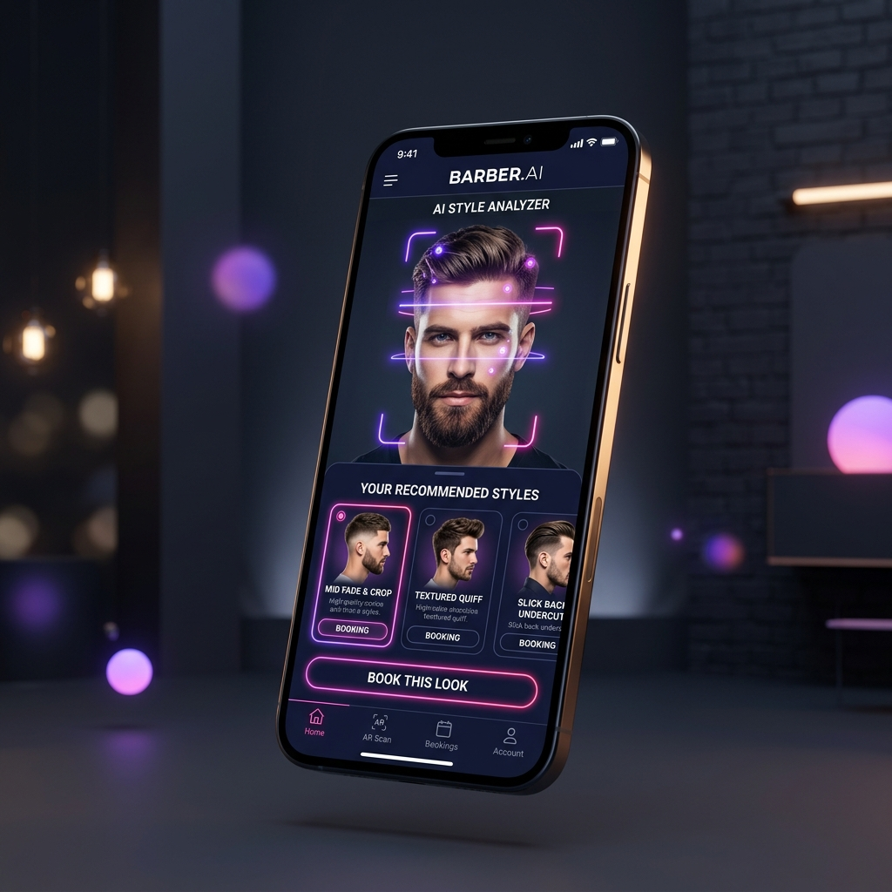

<div align="center">

</div>

# BarberAI ✂️✨

**Find Your Perfect Cut, Powered by AI.**

BarberAI is a premium, full-stack web application designed to connect customers with top-rated local barbers using the power of AI. Built with React, Node.js, and Firebase, BarberAI analyzes face shapes to recommend the best hairstyles and provides a seamless booking experience.

✨ **Built for [AI Seekho 2026](https://rsvp.withgoogle.com/events/aiseekho2026) - #VibeKaregaPakistan** ✨

## Features

- **💇‍♂️ AI Style Match:** Upload a photo and let Google's Gemini AI analyze your face shape to recommend the best haircuts.
- **📅 Seamless Booking:** Browse local barbers, view their portfolios, and book appointments instantly.
- **🧔 Barber Profiles:** Barbers can create premium profiles, list their services, and manage their bookings.
- **🎨 Premium UI:** A sleek, glassmorphism-inspired dark theme with responsive animations.

## Tech Stack

- **Frontend:** React, TypeScript, Tailwind CSS, Vite
- **Backend:** Node.js, Express
- **AI Integration:** Google Gemini API (`@google/genai`)
- **Database & Auth:** Firebase Firestore, Firebase Authentication

## Run Locally

**Prerequisites:** Node.js, Firebase Project, Gemini API Key

1. Install dependencies:
   ```bash
   npm install
   ```

2. Setup Environment Variables:
   Create a `.env` file in the root directory and add:
   ```env
   VITE_FIREBASE_API_KEY=your_api_key
   VITE_FIREBASE_AUTH_DOMAIN=your_auth_domain
   VITE_FIREBASE_PROJECT_ID=your_project_id
   VITE_FIREBASE_STORAGE_BUCKET=your_storage_bucket
   VITE_FIREBASE_MESSAGING_SENDER_ID=your_messaging_sender_id
   VITE_FIREBASE_APP_ID=your_app_id
   GEMINI_API_KEY=your_gemini_api_key
   ```

3. Start the development server:
   ```bash
   npm run dev
   ```

## License
MIT License

